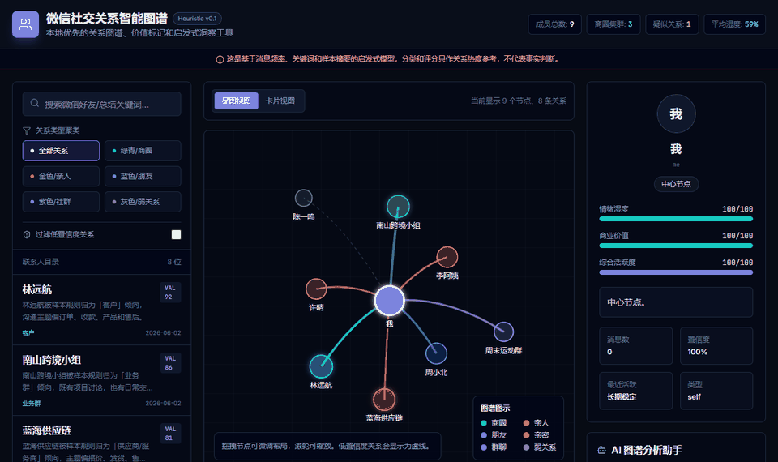
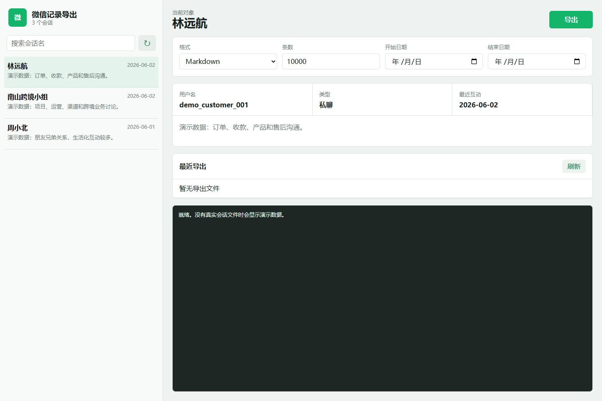
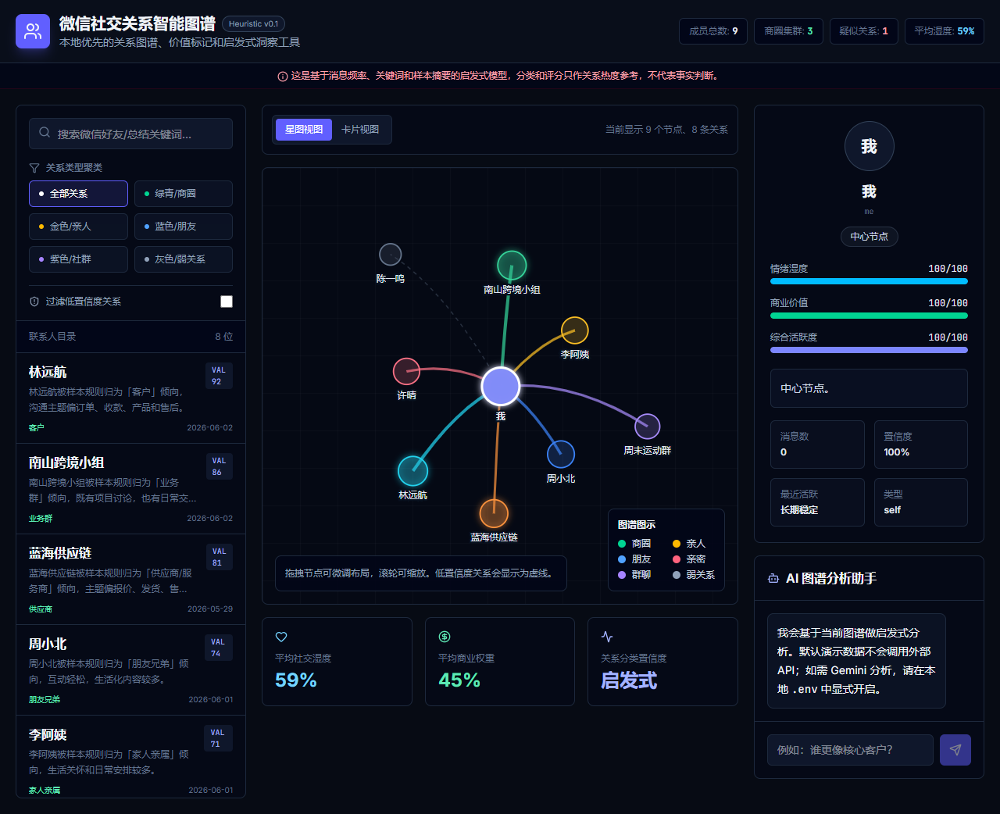

# WeChat Relationship Toolkit

一个本地优先的微信记忆整理工具，用图谱帮你重新看见关系和信息沉淀。

A local-first WeChat memory tool that helps you rediscover relationships and information through graphs.



把散落在微信里的聊天、联系人和群组，整理成可导出、可分析、可视化的个人关系图谱。默认使用合成 demo 数据演示；真实聊天记录不会进入仓库，也不会默认上传到任何外部 API。





## 为什么做这个

微信里沉淀了大量关系、业务、项目和生活记忆，但它们通常被锁在聊天列表里，很难被重新整理和观察。

这个项目尝试用一种克制的方式处理这些数据：

- 本地优先，真实数据默认只留在你的电脑上。
- 先导出，再处理，再可视化，三层分开。
- 关系判断只做启发式分析，不把标签当成事实。
- AI 分析默认关闭，需要你显式配置 API key 才会启用。

## 三层结构

```text
apps/
  export-ui/              # 本地微信导出界面
  relationship-graph/     # 关系图谱前端，可选 Gemini 分析

packages/
  wechat-export/          # 导出层脚本，基于 @jackwener/wx-cli
  relationship-engine/    # 数据处理层：会话 -> 关系图谱 JSON/CSV

examples/
  demo-data/              # 合成演示数据

docs/
  API.md                  # API 接入说明
  PRIVACY.md              # 隐私与开源检查清单
  assets/                 # README 演示截图和 GIF
```

## 快速开始

### 1. 微信导出层

```powershell
npx @jackwener/wx-cli init --force
.\packages\wechat-export\start_export_ui.ps1
```

打开 `http://127.0.0.1:4789` 后，点击刷新会话，再指定联系人导出 Markdown、TXT、JSON 或 YAML。

没有真实会话文件时，导出 UI 会显示合成 demo 会话，方便预览界面。

### 2. 数据处理层

```powershell
python .\packages\relationship-engine\build_relationship_graph.py
```

处理脚本默认读取本地 `output/wx_sessions.json` 和导出的样本聊天记录，输出：

```text
output/gemini_relationship_materials/relationship-graph.json
output/gemini_relationship_materials/nodes.csv
output/gemini_relationship_materials/edges.csv
```

这些真实输出默认被 `.gitignore` 排除，不要提交。

### 3. 前端展示层

```powershell
cd apps\relationship-graph
npm install --registry=https://registry.npmjs.org
npm run dev
```

默认加载 `examples/demo-data/relationship-graph.demo.json`，所以首次运行不会读取任何真实微信数据。

## Gemini/API 接入

AI 分析默认关闭。需要时在 `apps/relationship-graph/.env` 里显式开启：

```env
GEMINI_API_KEY=your_key_here
GEMINI_MODEL=gemini-2.5-flash
ENABLE_AI_ANALYSIS=true
PORT=3000
```

更多说明见 [docs/API.md](docs/API.md)。

## 隐私原则

- 不提交 `output/`、`.wx-cli`、真实聊天记录、真实联系人、数据库、日志、zip。
- README 图片只用 demo 数据截图。
- AI 分析只发送图谱摘要，不发送原始聊天全文。
- 关系标签是启发式结果，只能作为观察线索，不能当作事实判断。

开源前检查清单见 [docs/PRIVACY.md](docs/PRIVACY.md)。

## 开源前检查

```powershell
git status --short
rg "wxid_|gh_|all_keys|db_storage|手机号|真实姓名|抖音 codex|汇星|GEMINI_API_KEY=" .
```

如果以上搜索命中真实个人数据，先移到仓库外的私有包裹再提交。
